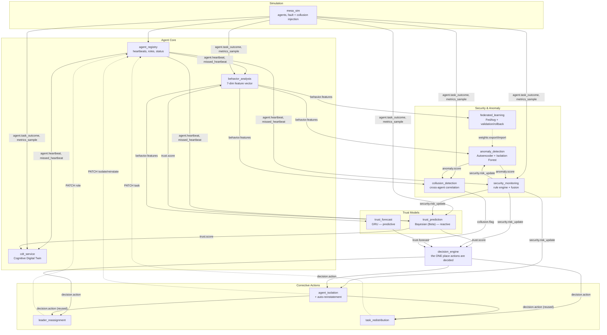

# NeuroTrust Mesh — Architecture

This document describes how the system is actually built: the event
topology, each service's responsibility, the ML models and the math
behind them, and the design decisions (including the ones that didn't
work) made while building it.

## Design principles

1. **Explainability over black-box scoring.** Every corrective action is
   logged with the exact rule and evidence that triggered it. This is why
   trust scoring, security rules, and the decision table are kept as
   separate, inspectable models rather than one opaque classifier.
2. **Event-driven, not request/response.** Trust and behavior signals are
   continuous streams, not one-off queries. Every service communicates
   over one RabbitMQ topic exchange (`neurotrust.events`), publishing and
   subscribing by routing key. No service calls another's business logic
   directly over HTTP except for the few places that genuinely need a
   synchronous action (isolation → registry status change, task pull).
3. **Detect deviation from an agent's own history, not a global norm.**
   Trust, behavior features, and anomaly detection are all calibrated
   per-agent. An agent's "normal" latency may be another agent's anomaly.
4. **Fuse independent signals conservatively.** Wherever two detectors
   feed one decision (rule engine + anomaly ensemble, reactive + predictive
   trust), they're combined via `max()`, and the highest-risk rule
   (collusion) is deliberately barred from ever triggering the highest-risk
   action (auto-isolation) — it can only ever route to human review.

## System diagram

## Event bus topology

One RabbitMQ topic exchange (`neurotrust.events`), one durable queue per
`(service, routing_key)` pair. Every event schema lives in
`libs/neurotrust_common/neurotrust_common/schemas.py`.

| Routing key | Published by | Consumed by |
|---|---|---|
| `agent.heartbeat` | `agent_registry` | `cdt_service`, `behavior_analysis`, `trust_prediction`, `security_monitoring` |
| `agent.missed_heartbeat` | `agent_registry` | `trust_prediction`, `security_monitoring` |
| `agent.task_outcome` | `mesa_sim` | `cdt_service`, `behavior_analysis`, `trust_prediction`, `security_monitoring`, `collusion_detection` |
| `agent.metrics_sample` | `mesa_sim` | `cdt_service`, `behavior_analysis`, `security_monitoring`, `collusion_detection` |
| `behavior.features` | `behavior_analysis` | `anomaly_detection`, `trust_forecast`, `collusion_detection`, `federated_learning` |
| `trust.score` | `trust_prediction` | `decision_engine`, `behavior_analysis`, `cdt_service` |
| `anomaly.score` | `anomaly_detection` | `security_monitoring`, `collusion_detection` |
| `trust.forecast` | `trust_forecast` | `decision_engine` |
| `security.risk_update` | `security_monitoring` | `decision_engine`, `trust_prediction`, `anomaly_detection`, `agent_isolation` |
| `collusion.flag` | `collusion_detection` | `decision_engine` |
| `decision.action` | `decision_engine`, `agent_isolation` (reused) | `leader_reassignment`, `task_redistribution`, `agent_isolation` |

`federated_learning` and `anomaly_detection` also talk directly over HTTP
(`GET /models/export`, `POST /models/import_federated`) since weight
transfer isn't a streaming signal — it's a discrete, occasional pull/push.
`leader_reassignment`, `task_redistribution`, and `agent_isolation` call
`agent_registry`'s HTTP API for the same reason: a role/status/task change
is a synchronous state mutation, not a stream.

## Services

### Agent core

**`agent_registry`** — the source of truth for agent identity, role,
status, and current task. Runs a background monitor that flags an agent
silent after 3 missed heartbeats (5s cadence). Every status/role/task
mutation goes through here, so every other service that filters
"active workers" gets a consistent view for free.

**`cdt_service`** — one Cognitive Digital Twin per agent: a state mirror
(latest snapshot), a short-term rolling window (last ~50 events), and a
long-term compressed summary (outcome counters). This is what makes an
isolated agent's "observation mode" possible — its twin keeps updating
even after isolation, just excluded from task/leadership eligibility.

**`behavior_analysis`** — builds the 7-dim feature vector every other ML
model consumes: `task_completion_rate`, `avg_response_latency`,
`comms_frequency`, `resource_utilization`, `bayesian_trust_score`,
`bayesian_confidence`, `role_flag`. Latency and resource usage are
normalized via a **z-score run through a logistic squash** against each
agent's own rolling history — not min-max (see [Build history](#build-history--design-decisions)
for why that mattered).

### Trust models

**`trust_prediction`** (Model A — Bayesian Beta) — two counters per agent,
`α` (successes) and `β` (failures), decayed each tick (`λ=0.97`, tightened
to `0.90` while an agent is under security watch) and updated on new
evidence with severity-weighted increments (missed heartbeat=1.0,
failed task=3.0, security-flagged=5.0). `trust_score = α/(α+β)`, with a
one-sentence plain-English explanation generated from the same counters.
Leaders are held to a stricter threshold (0.65) than workers (0.45) — a
bad leader affects the whole team.

**`trust_forecast`** (Model B — GRU) — two-layer GRU (64→32 units) over a
20-timestep window of the same 7-dim feature vector, with two output heads
(sigmoid mean, softplus std) trained on a Gaussian NLL loss. Predicts
trust one step ahead, with a genuine confidence interval — the decision
engine only acts on a forecast when `1/predicted_std` clears a minimum
confidence bar. Fine-tunes online every 100 new timesteps at a low
learning rate instead of full retraining.

### Security & anomaly

**`anomaly_detection`** (Model C — Autoencoder + Isolation Forest
ensemble) — per-agent 7→16→4→16→7 autoencoder, trained via **k-fold
cross-validation** (not a literal train-set threshold — see below) so
`threshold = mean_error + 3·std_error` reflects genuine held-out
generalization error. Complemented by a per-agent **Isolation Forest**
(scikit-learn, named in the original tool list but unused until this
addition) specifically because it's strong exactly where the autoencoder
measured weak: point anomalies. Their normalized scores combine via
`max()`; the combined decision requires **2 consecutive elevated
readings** before actually flagging (persistence smoothing). Training
data is gated by a **contamination pause** — driven by `security_score`
alone, never the fused `combined_risk` — so an agent's own borderline
anomaly output can never block its own future training data (see the
feedback-loop postmortem below). Agents with no local model yet fall back
to the federated model from `federated_learning`.

**`security_monitoring`** — rule-based detection needing no training data:
`silent_agent` (missed heartbeats), `message_flooding` (comms burst vs.
role-based threshold), `resource_spike` (sudden deviation from an agent's
own baseline), `security_flagged_outcome` (a stand-in for
`spoofed_identity`/`task_contradiction`, since this system doesn't
simulate message signatures or downstream task verification).
`replay_attack`, `impossible_transition`, and `leader_override_abuse` are
**not implemented** — they'd need message-hash, task-state-machine, or
command-authorization data this system doesn't produce, and faking them
would be worse than omitting them. `combined_security_risk =
max(security_score/10, anomaly_risk)`.

**`collusion_detection`** — four signals per agent pair, each requiring
`≥MIN_OVERLAP_SAMPLES` aligned samples: timing correlation (anomaly-score
series), behavioral similarity (cosine similarity of feature-deviation
vectors, deliberately excluding two dimensions that turned out to be
near-constant across every agent — see below), comms-graph anomaly, and
outcome corroboration. `expected_correlation` is fixed at 0 (no task graph
exists to compute a real baseline from — the most conservative choice
available). A pair needs **≥2 of 4 signals elevated** in a window, and
that must **persist across ≥3 consecutive windows**, before its group
gets flagged — and even then, the decision engine can only ever emit
`flag_for_review`, never `isolate`. This is explicitly the highest
false-positive-risk rule in the system per the original design docs.

**`federated_learning`** — FedAvg over every currently-trained agent's
autoencoder weights (unweighted mean; this system has no per-client
sample-count metadata to weight by), validated against a pooled,
cross-agent held-out sample set the aggregator never trains on. A merged
model is only pushed to `anomaly_detection` if its validation error
doesn't exceed the last known-good model's by more than a small
tolerance — otherwise the round is silently rejected and the previous
best keeps serving (automatic rollback). GRU federation isn't implemented
— documented as the same pattern, not yet duplicated, rather than silently
skipped.

### Decision & corrective actions

**`decision_engine`** — the only service that decides an action. Four
independent triggers, each with its own cooldown to prevent flapping:
reactive trust threshold, predictive forecast threshold (gated on forecast
confidence), fused security risk threshold (bypasses the normal cooldown
— security flags act fast), and collusion persistence (always routes to
`flag_for_review`, never `isolate`). Every decision is logged with the
literal rule string and the input values that triggered it.

**`leader_reassignment`** / **`task_redistribution`** — ranked by current
trust score among active, eligible candidates; includes a cooldown to
avoid leadership flapping near the threshold.

**`agent_isolation`** — executes isolation, then *reuses*
`task_redistribution`'s and `leader_reassignment`'s own logic by
republishing `decision.action` events, rather than duplicating the
candidate-selection code. Runs a **sustained-recovery check**: an isolated
agent whose fused risk stays below the watch threshold for 60 continuous
seconds is automatically reinstated. Without this, isolation was a
one-way door — any nonzero false-positive rate anywhere upstream
compounded into "every agent eventually isolated forever" over a long
enough run.

## Data flow: a worked example

A faulty agent's task fails, and the system reacts:

1. `mesa_sim` publishes `agent.task_outcome(outcome=failed_critical)`.
2. `trust_prediction` applies the evidence (β += 3.0), recomputes
   `trust_score`, publishes `trust.score`.
3. `behavior_analysis` updates the agent's feature vector, publishes
   `behavior.features`.
4. `anomaly_detection` scores the new vector against the agent's own
   trained ensemble; if both models agree twice in a row, publishes
   `anomaly.score(is_anomalous=True)`.
5. `security_monitoring` folds the anomaly score into
   `combined_security_risk`, publishes `security.risk_update`.
6. `decision_engine` sees `trust.score` cross the worker threshold *and*
   (independently, on its own cooldown) `security.risk_update` cross the
   isolation threshold — publishes `decision.action(redistribute_tasks)`
   and, if warranted, `decision.action(isolate)`.
7. `task_redistribution` moves the agent's pending task to another
   trusted, active worker. `agent_isolation` marks the agent isolated,
   pulls any remaining task, and starts watching for sustained recovery.
8. Once the agent's risk profile settles back down for 60 continuous
   seconds, `agent_isolation` reinstates it automatically.

## Build history & design decisions

Six planned milestones, plus a follow-up tuning pass. The interesting
parts are the bugs found and fixed along the way — several were only
caught because live behavior diverged sharply from offline test
expectations, which is why the test suite leans on *realistic*-noise
regression tests, not just idealized synthetic ones.

**M1 — Agent core, Bayesian trust, minimal decision loop.** First working
vertical slice. Caught during audit: `mapped_column(default=...)` in
SQLAlchemy only applies at flush time, so a freshly-created row's default
fields were `None` if read before the first commit — the very first
evidence event for any new agent was silently dropped. Fixed by passing
defaults explicitly in every `_get_or_create` helper across the codebase.
Also found: `logging.LoggerAdapter.process()` unconditionally overwrites
`kwargs["extra"]` with its own extra, silently discarding every
`extra={"trace": {...}}` passed at call sites — every structured log in
the system had been dropping its evidence payload since day one. Fixed
with a merging `ServiceLoggerAdapter`.

**M2 — Security rules, real isolation.** Added the rule engine and made
isolation an actual state change (not a stub). mesa_sim's fault model
gained real message-flooding bursts and silent ticks so the new rules had
genuine data to react to.

**M3 — Autoencoder anomaly detection.** The threshold-calibration saga:
a literal reading of "threshold = mean + 3·std, computed on the training
set" memorizes a ~30-sample training set almost immediately, making the
threshold razor-thin — confirmed live, nearly every healthy agent got
isolated. First fix (single random holdout split) passed its own unit
test but was itself statistically fragile at this data scale — a
different unlucky split on a later rebuild reproduced the same cascade.
Second fix: **k-fold cross-validation**, pooling held-out errors across
folds for a materially more stable threshold estimate while still
training the deployed model on all available data.

**M4 — GRU forecaster.** Introduced a genuinely deep bug: `behavior_analysis`
was normalizing latency/resource via min-max over a small rolling window
of unbounded Gaussian noise — the normalized value could swing 0.75→0.47
in three seconds for a *completely healthy, unchanging* agent. This fed
every downstream model unstable input. Replaced with a z-score run through
a logistic squash, which changes gradually as the running mean/std shift
instead of being dominated by whichever single sample is currently most
extreme. Also found and fixed a **self-referential feedback loop**: the
anomaly detector's own contamination gate (deciding whether to buffer new
training data) was driven by `combined_risk`, which includes the
detector's *own* prior output — an agent whose score crossed the watch
threshold from ordinary noise could get permanently locked out of
corrective retraining. Fixed by gating on `security_score` (independent
rule-engine signals) alone.

**M5 — Collusion detection.** Offline validation initially showed 0% false
positives — but live, `behavior_similarity` was elevated for *every* pair,
including totally unrelated agents. Root cause: `comms_frequency` (pinned
at 1.0 by heartbeat-cadence math) and `bayesian_confidence` (converges to
~0.99+ for any evidenced agent) contributed nearly identical deviation
vectors for every agent regardless of true correlation. The synthetic
test fixture had varied those fields independently per agent, which is
exactly why it didn't catch the bug — fixed both the signal (drop those
two dimensions) and the test fixture (make it match live data shape).

**M6 — Federated learning.** Implemented FedAvg + validation/rollback for
the autoencoder; verified live that a brand-new agent with zero local
training data got a real, non-zero anomaly score purely from the
federated fallback model.

**Tuning pass — persistence smoothing + Isolation Forest.** After M1–M6,
the anomaly detector still had a real single-reading false-positive rate
(~6% empirically, vs. the ~0.3% a Gaussian mean+3σ threshold implies —
reconstruction error is a non-negative, right-skewed distribution, so the
Gaussian assumption itself was part of the gap). Two approaches were
tried and **rejected with evidence** before landing on the fix that
worked:
- Percentile-based threshold instead of mean+3σ: FPR nearly tripled
  (6%→14%) — with only ~30-40 pooled calibration samples, percentile
  estimation is *less* stable than the parametric approach, not more.
- Higher std multiplier (4–6): killed fault detection to 0% for a
  marginal FPR gain — the detector was already weak, so there was nothing
  left to trade away.
- What worked: **persistence smoothing** (require 2 consecutive elevated
  readings, same pattern already proven in `security_monitoring` and
  `collusion_detection`), plus adding **Isolation Forest** as a genuine
  ensemble complement once offline validation showed the autoencoder's
  core detection power was weak independent of calibration (8% detection
  on an unambiguous point anomaly). Combined offline result: 94.4%
  detection at 5.5% FPR, versus the autoencoder alone's 0.8% / 6.1%.

## Known limitations

See the [README](README.md#known-limitations) for the concise list. In
more detail:

- **Collusion's `expected_correlation` baseline is always 0.** The
  original design calls for `observed_correlation − expected_correlation`,
  where the expected term comes from task-graph/hierarchy structure. This
  system's simulation has no inter-agent task dependencies to compute that
  baseline from, so it's fixed at the most conservative value rather than
  faked.
- **Federated learning treats the whole fleet as one cluster.** No
  multi-cluster topology, no per-client weighting in the FedAvg average.
- **GRU (Model B) isn't federated**, only the Autoencoder (Model C) is —
  the docs call out both as federatable; this repo demonstrates the full
  loop once, end-to-end, rather than duplicating it shallowly twice.
- **Some security rules are unimplemented by design**: `replay_attack`,
  `impossible_transition`, `leader_override_abuse` need data (message
  hashes, a formal task state machine, command authorization) this system
  doesn't produce. `security_flagged_outcome` and `resource_spike` are
  documented stand-ins for the closest concepts that *are* implementable
  given the actual event stream.
- **No human-review UI or Control Center override API.** Collusion flags
  are queryable (`GET /reviews` on `collusion_detection`) but there's no
  approve/dismiss workflow. This is explicitly listed last in the original
  design docs' own build order, after federated learning — out of scope
  for this build.
- **The anomaly detector's residual false-positive rate is nonzero.**
  Reduced substantially (see Tuning pass above) but not eliminated;
  auto-reinstatement is what makes that survivable rather than the
  detector being perfectly calibrated.
